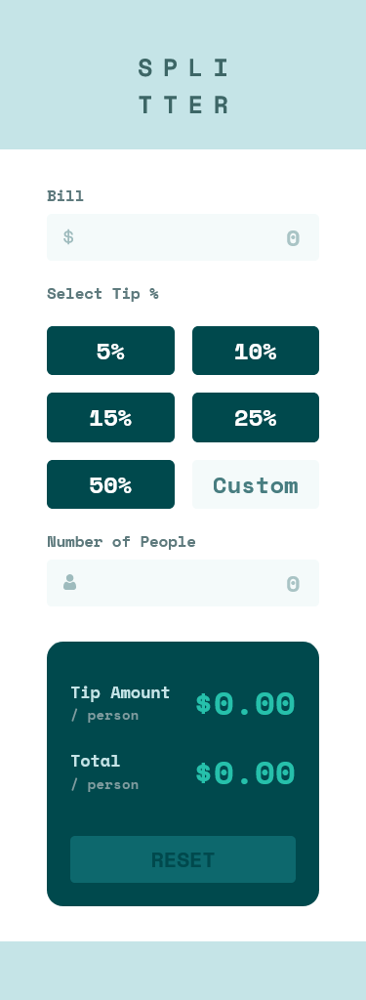
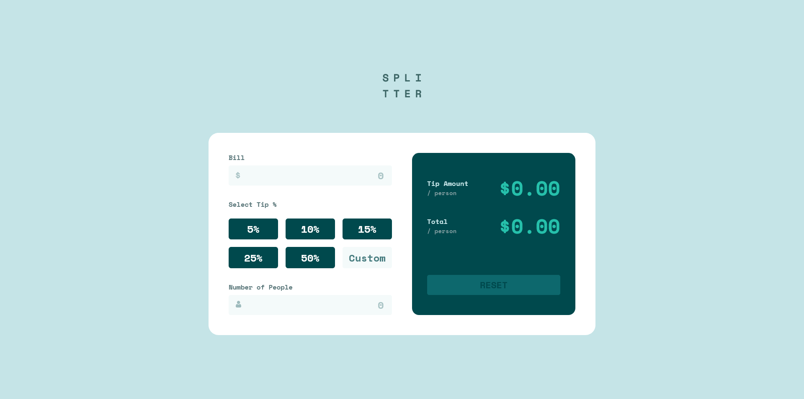

# Frontend Mentor - Tip calculator app solution

This is a solution to the [Tip calculator app challenge on Frontend Mentor](https://www.frontendmentor.io/challenges/tip-calculator-app-ugJNGbJUX). Frontend Mentor challenges help you improve your coding skills by building realistic projects.

## Table of contents

- [Overview](#overview)
  - [The challenge](#the-challenge)
  - [Screenshot](#screenshot)
  - [Links](#links)
- [My process](#my-process)
  - [Built with](#built-with)
  - [What I learned](#what-i-learned)
  - [Continued development](#continued-development)
- [Author](#author)

## Overview

### The challenge

Users should be able to:

- View the optimal layout for the app depending on their device's screen size
- See hover states for all interactive elements on the page
- Calculate the correct tip and total cost of the bill per person

### Screenshot




### Links

- Solution URL: [Github](https://your-solution-url.com)
- Live Site URL: [Netlify](https://your-live-site-url.com)

## My process

### Built with

- Semantic HTML5 markup
- CSS custom properties
- Flexbox
- CSS Grid
- Mobile-first workflow

### What I learned

It's better to use 100vh instead of 100% on body and html:

```CSS
html, body {
    min-height: 100vh;
}
```

We're not using alt on svg logo images:

```HTML

```

Changed placeholder and focus on input with these CSS selectors and attributes:

```CSS
.form__input:focus {
    outline: solid 2px var(--clr-strong-cyan);
}

.form__input::placeholder {
    color: var(--clr-very-dark-cyan);
    opacity: 0.3;
}
```

Placed icons inside of input with these:

```CSS
.dollar-icon {
    background-image: url(images/icon-dollar.svg);
    background-repeat: no-repeat;
    background-position: 0.7rem 0.6rem;
}

.people-icon {
    background-image: url(./images/icon-person.svg);
    background-repeat: no-repeat;
    background-position: 0.7rem 0.6rem;
}
```

### Continued development

My JavaScript is still very messy and probably buggy, gotta work on that for sure!

## Author

- Github - [Mike Beloborodov](https://github.com/MikeBeloborodov)
- Frontend Mentor - [@MikeBeloborodov](https://www.frontendmentor.io/profile/MikeBeloborodov)